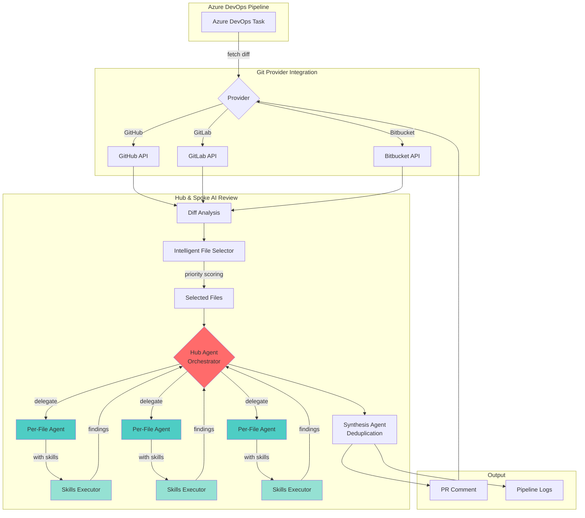
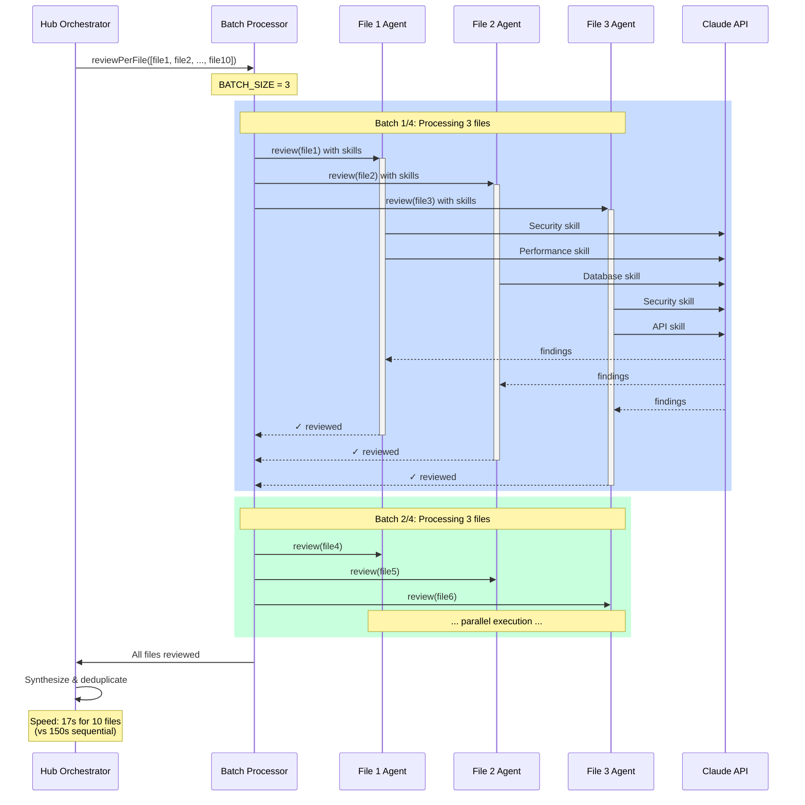
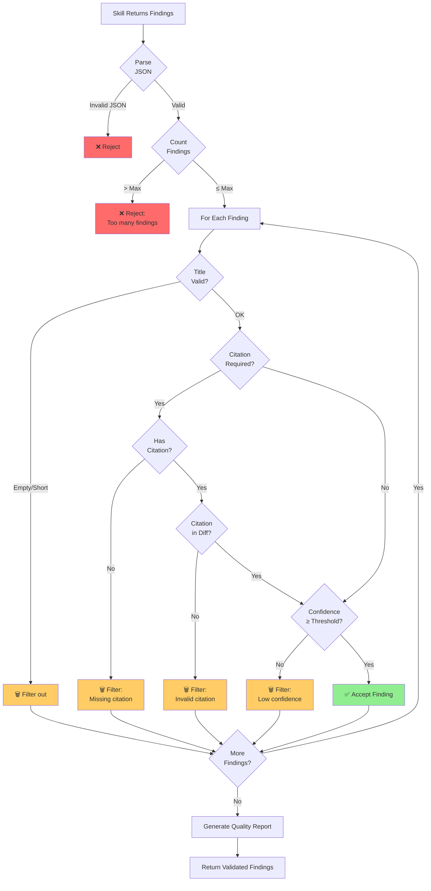
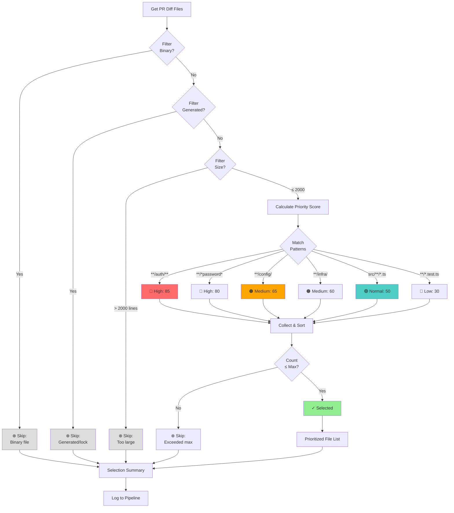
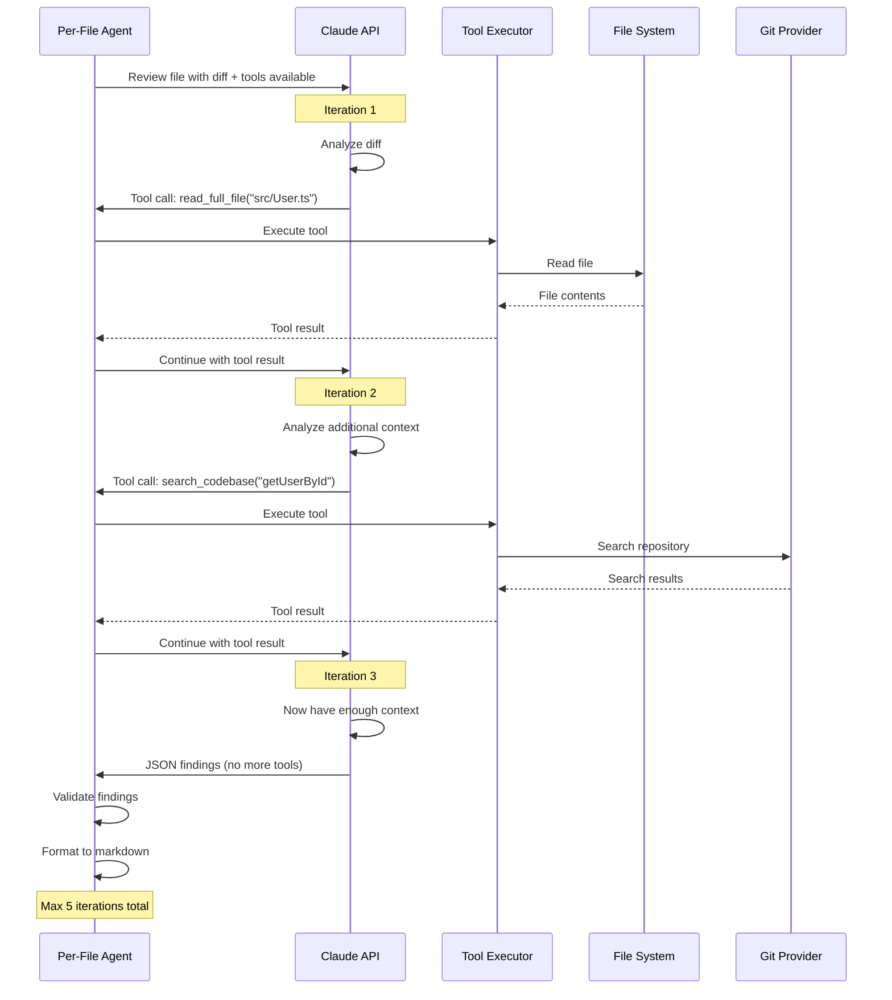
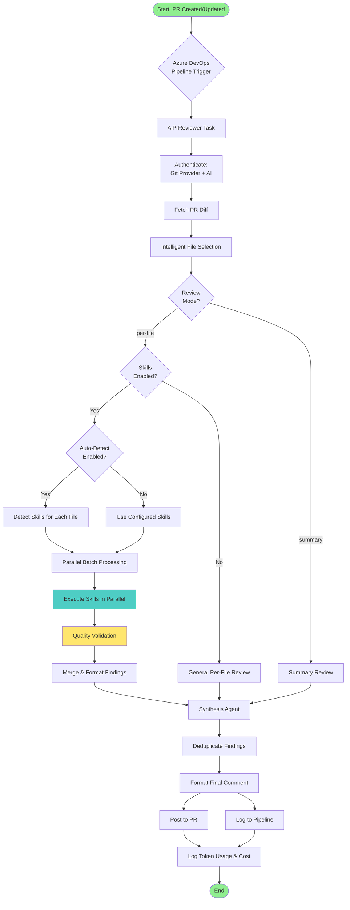

# AI PR Reviewer - Architecture Diagrams

This document contains mermaid diagrams showing the architecture and workflow of the AI PR Reviewer, including the specialized skills system.

## Table of Contents
- [Hub & Spoke Architecture](#hub--spoke-architecture)
- [Skills Execution Flow](#skills-execution-flow)
- [Parallel Processing](#parallel-processing)
- [Quality Validation Pipeline](#quality-validation-pipeline)
- [File Selection Logic](#file-selection-logic)
- [Tool Calling Flow](#tool-calling-flow)

---

## Hub & Spoke Architecture



**Key Points:**
- **Hub** coordinates per-file reviews and dependencies
- **Spokes** review individual files with specialized skills
- **Parallel execution** - 3 files at a time (configurable)
- **Synthesizer** deduplicates and formats final output

---

## Skills Execution Flow

```mermaid
graph LR
    subgraph "File Analysis"
        File[File: src/auth/login.ts] --> Detection{Auto-Detect<br/>Enabled?}
        
        Detection -->|Yes| Patterns[Pattern Matching]
        Detection -->|No| Config[Config Skills Only]
        
        Patterns --> |**/auth/**| PatternMatch[✓ Security]
        Patterns --> |SELECT query| ContentMatch[✓ Database]
        
        Config --> ConfigSkills[security, performance]
        
        PatternMatch --> Merge[Merge Skills]
        ContentMatch --> Merge
        ConfigSkills --> Merge
    end
    
    subgraph "Parallel Execution"
        Merge --> |Security| Skill1[Security Skill Agent]
        Merge --> |Database| Skill2[Database Skill Agent]
        Merge --> |Performance| Skill3[Performance Skill Agent]
        
        Skill1 --> |API call| Claude1[Claude API]
        Skill2 --> |API call| Claude2[Claude API]
        Skill3 --> |API call| Claude3[Claude API]
        
        Claude1 --> |JSON findings| Result1[2 findings]
        Claude2 --> |JSON findings| Result2[1 finding]
        Claude3 --> |JSON findings| Result3[0 findings]
    end
    
    subgraph "Quality Validation"
        Result1 --> Validator{Quality<br/>Validator}
        Result2 --> Validator
        Result3 --> Validator
        
        Validator --> |check| CitationCheck[Citation Check]
        Validator --> |check| ConfidenceCheck[Confidence ≥ 75%]
        Validator --> |check| LimitCheck[Max 10 findings]
        
        CitationCheck --> Filtered[Filtered Findings]
        ConfidenceCheck --> Filtered
        LimitCheck --> Filtered
    end
    
    subgraph "Output"
        Filtered --> Format[Format to Markdown]
        Format --> Final[Final Review Comment]
    end
    
    style Skill1 fill:#ff6b6b
    style Skill2 fill:#4ecdc4
    style Skill3 fill:#ffe66d
    style Validator fill:#95e1d3
```



**Process:**
1. **Auto-Detection** - Match file patterns and content
2. **Parallel Execution** - All skills run simultaneously via Claude API
3. **Quality Validation** - Filter by citations, confidence, limits
4. **Formatting** - Convert to markdown with severity colors

---

## Parallel Processing



**Benefits:**
- **85% faster** than sequential execution
- **Batching prevents overload** - 3 files at a time
- **Skills run in parallel** within each file
- **Efficient API usage** - multiple concurrent requests

---

## Quality Validation Pipeline



**Validation Layers:**
1. **JSON Structure** - Must parse correctly
2. **Count Limits** - Max 8-10 findings per file
3. **Title Validation** - Must be meaningful
4. **Citation Checking** - Required for high-quality skills
5. **Citation Matching** - Must reference actual diff lines
6. **Confidence Threshold** - Typically 70-80% minimum

**Quality Report Example:**
```
Security: 5/5 accepted (100% quality)
Performance: 3/4 accepted (75% quality)
  - 1 filtered: missing citation
```

---

## File Selection Logic



**Priority Factors:**
- **Security patterns** (auth, secrets, crypto) → 70-100
- **Infrastructure** (config, terraform, docker) → 60-70
- **Source code** (app logic) → 50-60
- **Tests/docs** → 20-40

**Skip Patterns:**
- `package-lock.json`, `yarn.lock`, `Gemfile.lock`
- `*.min.js`, `*.bundle.js`, `dist/**`, `build/**`
- `node_modules/**`, `vendor/**`
- Binary files (images, PDFs, etc.)

---

## Tool Calling Flow



**Available Tools:**
1. **read_full_file** - Get complete file contents
2. **read_file_section** - Get specific line range
3. **search_codebase** - Find patterns/references
4. **list_directory** - Explore structure

**When Used:**
- Understanding context beyond visible diff
- Tracing function calls across files
- Verifying breaking changes impact
- Checking schema usage in migrations

**Cost Impact:**
- +15-25% token usage
- ~500-2000 tokens per tool call
- Worth it for complex, high-risk PRs

---

## Complete Review Workflow



**Full Pipeline:**
1. **Trigger** - PR event in Azure DevOps
2. **Authentication** - Git provider + Anthropic API
3. **File Selection** - Priority-based filtering
4. **Skills Detection** - Pattern matching + auto-detect
5. **Parallel Execution** - Batch processing with skills
6. **Quality Validation** - Multi-layer filtering
7. **Synthesis** - Deduplicate and format
8. **Output** - Post comment + log metrics

---

## Architecture Decision Records

### Why Hub & Spoke?

**Benefits:**
- ✅ **Parallel processing** - Much faster than sequential
- ✅ **Specialized focus** - Each agent handles one file
- ✅ **Better context** - No confusion between files
- ✅ **Scalability** - Easy to add more spokes (files)

**Trade-offs:**
- ⚠️ **More API calls** - One per file + synthesis
- ⚠️ **Higher cost** - But faster and better quality
- ⚠️ **Complexity** - More moving parts

### Why Skills System?

**Benefits:**
- ✅ **Domain expertise** - Specialized prompts per domain
- ✅ **Quality scores** - Test suites validate performance
- ✅ **Parallel execution** - All skills run at once per file
- ✅ **Auto-detection** - Smart matching reduces config

**Trade-offs:**
- ⚠️ **Token cost** - 100-200% increase with multiple skills
- ⚠️ **Complexity** - More configuration options

### Why Parallel Batching?

**Benefits:**
- ✅ **85% faster** - 17s vs 150s for 10 files × 3 skills
- ✅ **Controlled load** - BATCH_SIZE prevents overload
- ✅ **API efficiency** - Multiple concurrent requests

**Trade-offs:**
- ⚠️ **Memory usage** - Multiple files in memory
- ⚠️ **Rate limits** - Need to respect API limits

---

## See Also

- [USER_GUIDE.md](./USER_GUIDE.md) - Complete configuration guide
- [USER_GUIDE_SKILLS.md](./USER_GUIDE_SKILLS.md) - Detailed skills documentation
- [ARCHITECTURE.md](../ARCHITECTURE.md) - Technical implementation details
